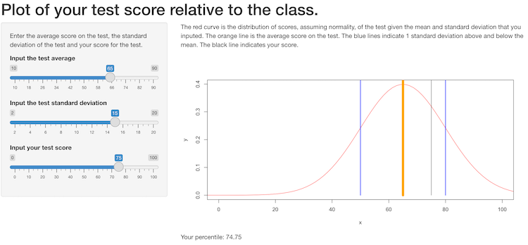

```{r setup, include=FALSE}
knitr::opts_chunk$set(echo = FALSE)
```

## Motivation

- Students are often eager to receive feedback on their academic assignments. For example, students tend to anticipate their scores on tests and are curious about what their scores are relative to the rest of their peers. 

- While instructors may provide students with the mean and standard deviation along with a score to students on a test, it can be hard for a student to understand exactly where their score stands in relation to the rest of the class. 

## Solution

An app that provides a visual sense of a student's score on a test compared to their classmates' scores will help them understand their relative score.

## Example

A student with a score of 75 on a test with a mean of 65 and a standard deviation of 15 may better understand their relative score with the following visualization.

```{r}
zVals <- seq (-5,5, length = 100)
x <- 65 + zVals * 15
y <- dnorm(zVals)

plot(x, y, xlim=c(0,100), col = "red", type = "l", xlab = "Scores", ylab = "Density")

lines(c(65, 65), c(0, 1), col="orange", lwd=7)
lines(c(50, 50), c(0,1), col = "blue", lwd = 2)
lines(c(80, 80), c(0,1), col = "blue", lwd = 2)
lines(c(75,75), c(0,1), col = "black", lwd = 1)
```

## Understanding Input and Output
The UI below shows what the input/output would look like for the example above. The user can move sliders to input the mean, standard deviation and test score. The orange line shows the mean, the blue lines show 1 standard deviation above/below the mean and the black line shows the student's score. The percentile is also included at the bottom.



